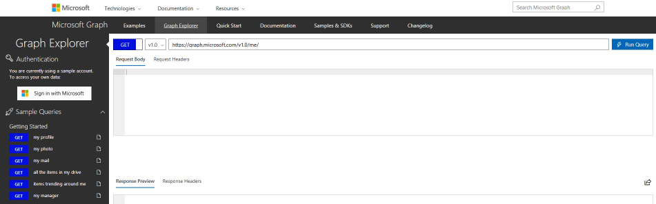
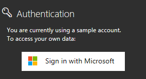
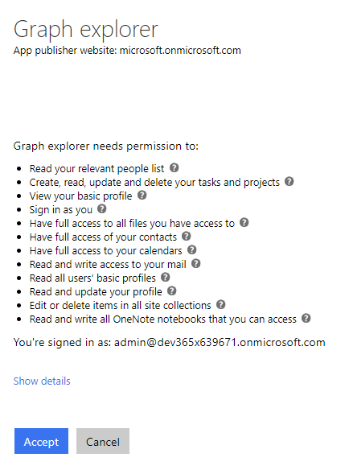
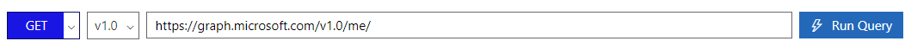

# Probando Microsoft Graph Explorer
En este laboratorio probaremos nuestras llamadas a Microsoft Graph API desde Microsoft Graph Explorer

## 1. Accediendo a Microsoft Graph Explorer
Para acceder a Microsoft Graph Explorer accederemos a la url https://developer.microsoft.com/en-us/graph/graph-explorer desde cualquier navegador.

## 2. Conociendo el entorno
Una vez hayamos accedido a Microsoft Graph Explorer veremos la interfaz web. 

### Autenticación
Desde esta zona podemos autenticarnos en nuestro tenant para probar nuestras queries.

Una vez introducido nuestro usuario, se nos muestra una ventana en la que debemos consentir los permisos requeridos por la aplicación.

### Consultas de ejemplo
Desde esta zona podemos ver consultas de ejemplo, que nos pueden servir como guía para hacer nuestras propias consultas

Pulsando sobre "show more samples" podremos seleccionar la categoría de las consultas

### Historial de consultas
En esta zona veremos todas las consultas que hayamos ejecutado. Si pulsamos sobre cualquiera de ella volveremos a ejecutarla.

### Consulta
En esta zona introduciremos la consulta que deseamos probar.

#### 1. Métodos HTTP

Podremos seleccionar los siguientes métodos:

- GET: Para consultar y leer recursos
- POST: Para crear recursos
- PUT: Para editar recursos
- DELETE: Para eliminar recursos.
- PATCH: Para editar partes concretas de un recurso.

Para los métodos GET y DELETE, no requiere un cuerpo de la petición.
Los métodos POST, PUT y PATCH requieren un cuerpo de la petición, usualmente especificado en formato JSON

> Si no nos hemos autenticado y estamos utilizando el tenant de pruebas, sólo podremos realizar llamadas GET

#### 2. Versión del API

Actualmente Microsoft Graph soporta de 2 versiones:

- 1.0: incluye las APIs de disposición general. Usa la versión 1.0 para las aplicaciones en producción
- beta: incluye las APIs en preview. Se recomienda no utilizar esta versión para producción ya que pueden sufrir modificaciones.

#### 3. Url del recurso

La URL incluirá el recurso o los recursos con los que está interactuando en la solicitud, como me, users, groups, drives y sites. Cada uno de los recursos de más alto nivel también incluye relaciones, que podemos utilizar para acceder a recursos adicionales, como me/messages o me/drive. También podemos interactuar con los recursos utilizando métodos; por ejemplo, para enviar un correo electrónico, utilizamos me/sendMail.

## 3. Consultas de ejemplo

Ejecuta las siguientes consultas para familiarizarte con la sintaxis de las llamadas a Microsoft Graph

+ Mi perfil  
 /v1.0/me/  

* Los primeros 5 usuarios de mi empresa  
/v1.0/users?$top=5

+ Mis blocs de notas  
/v1.0/me/onenote/notebooks

+ el sitio SharePoint principal de mi empresa  
/v1.0/sites/root

+ **Prueba tus propias consultas**